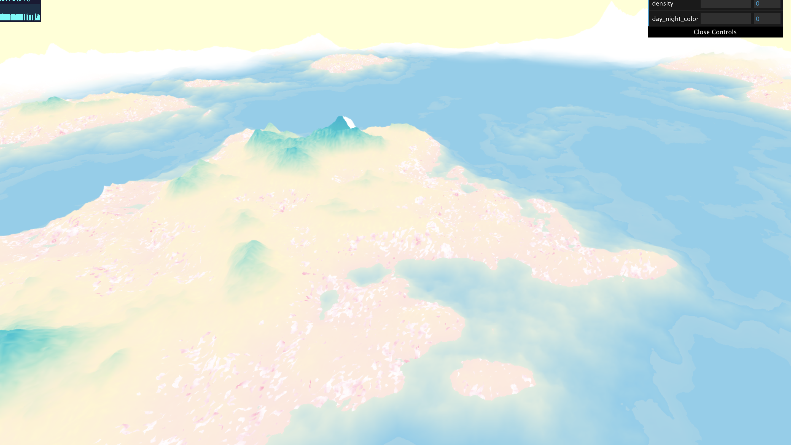

# CIS 566 Homework 1: Noisy Terrain

## Wendy Sun (wentings)

## Sources

The source that I found the most helpful is using [Making Maps with noise functions by Red Blob Games](https://www.redblobgames.com/maps/terrain-from-noise/). I referred to the source to create a elevation / moisture map, as well as making the mountains elevation more prominent with an exponential distribution. I also want to thank Adam and Nick for the tip on making the moutains farther apart and colors smoother. 

## Demo

https://wendy-sun-07.github.io/hw01-noisy-terrain/

## Techniques

I used two FBM functions to generate elevation and moisture that are later changed by exponential functions. The elevation FBM weights the earlier large shapes more than the detailed noise. I also used a Perlin noise function, which is then used as an input for an FBM function to generate the noise on the pink rock texture. Otherwise, the colors are generated using FBM and the mix() function to create a gradient based on its height or moisture.

I have two sliders for the density of the map, which is changed by dividing the position with inversely decreasing value while the density increases. I have another slide for the color of the sky, which linearly interpolates between light yellow and light blue.

